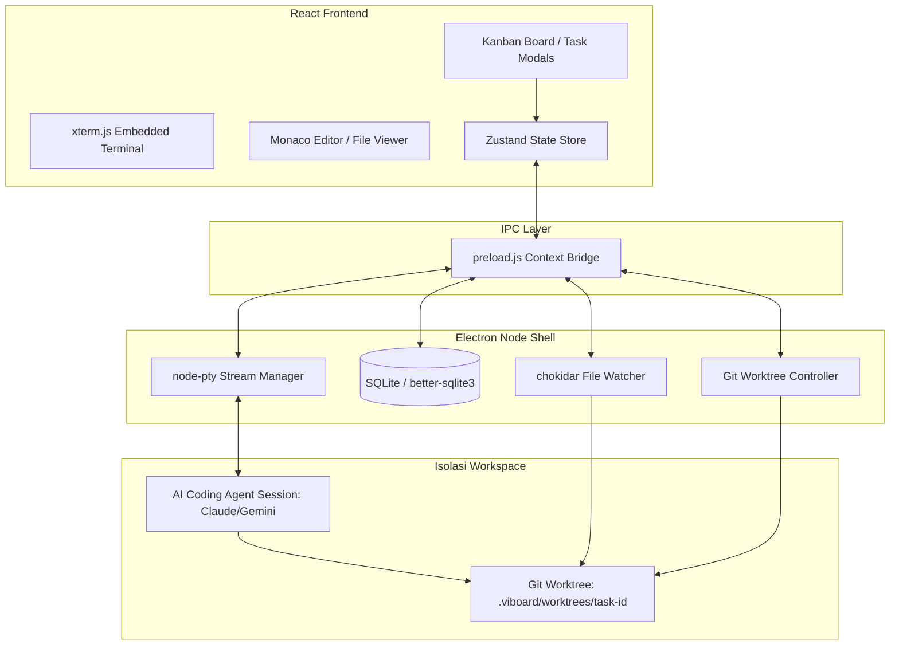

<p align="center">
  <br />
  
  <br />
  <samp><strong>V I B O A R D &nbsp; O N M I</strong></samp>
  <h1 align="center">ViBoard Omni</h1>
  <p align="center">
    <strong>A Sleek Developer's Kanban Board with Integrated Local AI Agent CLI Sessions</strong>
  </p>
</p>

<p align="center">
  <a href="https://www.electronjs.org/"></a>
  <a href="https://react.dev/"></a>
  <a href="https://tailwindcss.com/"></a>
  <a href="https://github.com/WiseLibs/better-sqlite3"></a>
</p>

<p align="center">
  <b>Safely sandbox, orchestrate, and visually track local AI coding agents directly from your task board.</b>
  <br />
  <sub>Built for developers who want the power of CLI agents without the chaos of dirty working trees.</sub>
</p>

---

## ⚡ Why ViBoard Omni?

AI coding agents (like Anthropic's **Claude Code** or Google's **Gemini CLI**) are incredibly fast, but running them directly in your workspace poses real challenges:

> [!WARNING]  
> **The Sandbox Danger**  
> CLI agents write code and run commands directly in your local directory. One buggy regex or bad command can overwrite your unstaged changes or mess up your Git history.

> [!NOTE]  
> **ViBoard Omni solves this by introducing visual orchestration and environment isolation:**

*   **🛡️ Git Worktree Isolation**: Every card automatically creates a dedicated Git worktree (`.viboard/worktrees/<taskId>`) under the hood. Agents run in their own sandbox, keeping your main branch and active files 100% safe.
*   **🧠 Visual Task Binding**: No more juggling session UUIDs in separate terminal tabs. Every card on the board binds to its own terminal state and automatically resumes its conversation context when clicked.
*   **🔍 Live Activity Tracking**: Stop guessing what the agent is doing. ViBoard parses the terminal output stream and shows real-time status badges (`Thinking` 🧠, `Tool Using` 🔧, `Responding` 💬) directly on the board.
*   **⚙️ Autonomous Warm-ups**: When a task moves to *In Progress*, ViBoard sets up the worktree and runs dependency installs (`npm/yarn/pnpm`) in the background so the agent is ready to code immediately.

---

## 🏛️ System Architecture

ViBoard Omni leverages a multi-process Electron architecture to isolate terminal streams, file watchers, and databases, keeping the React rendering process butter-smooth at a consistent **60 FPS**.



---

## 🔧 Core Mechanics Under the Hood

### 1. Sandboxed Git Worktrees
When a task moves to **In Progress**:
1. Electron issues a native git command: `git worktree add -b viboard/task-<id> .viboard/worktrees/<id>`.
2. A separate virtual branch is created, checking out the files into a subdirectory.
3. The AI agent's process is spawned with its current working directory (`CWD`) set *only* to this sandboxed path.
4. When the task is completed, you can review the changes and merge them safely into your main branch.

### 2. High-Performance PTY Buffering
AI agents print hundreds of lines of output in milliseconds. Piping raw terminal data directly to React components can freeze the browser thread.
* ViBoard Omni implements a **30 FPS frame-limiting buffer** (32ms interval flushing) for `node-pty`.
* Large stdout chunks are merged in the Node process and sent via IPC in throttled micro-batches.
* Embedded terminals use `@xterm/addon-fit` for responsive scaling inside Kanban cards.

### 3. Local SQLite Schema
All board states, terminal logs, and project metadata are saved locally in a fast, embedded SQLite database via `better-sqlite3`.
* **Zero Cloud Dependency**: Your data never leaves your computer.
* **Persistent Sessions**: Terminals are re-connected to the correct database-saved PTY sessions on app relaunch.

---

## ✨ Features

### 🗂️ Drag-and-Drop Kanban Board
*   Powered by `@dnd-kit` for seamless card dragging.
*   Fully editable columns, checklist subtasks, and custom tags.
*   Built-in project directory selector.

### 🤖 Embedded Terminals (xterm.js + node-pty)
*   Card-specific terminal sessions that look and feel premium.
*   Supports interactive CLI agent sessions.
*   Performance optimized to avoid CPU bottlenecks and UI lag.

### 🔌 Extensible CLI Drivers
*   **Claude Code** (`claude` CLI) with auto session-ID mapping.
*   **Gemini CLI** (`gemini` CLI) with automated resume flags.
*   **oh-my-pi** (`omp` binary).
*   **pi-agent**, **hermes**, **opencode**, and **custom commands**.

---

## 💻 Tech Stack

| Domain | Technologies |
| :--- | :--- |
| **Desktop Shell** | Electron 33, Electron-Vite |
| **Frontend UI** | React 19, TypeScript, Tailwind CSS v4, Zustand |
| **Terminal Core** | `@xterm/xterm`, `@cocktailpeanut/node-pty-prebuilt-multiarch` |
| **Local Database**| SQLite (`better-sqlite3`) |
| **Editor** | Monaco Editor (`@monaco-editor/react`) |

---

## 📂 Project Structure

```text
viboard-omni/
├── build/                      # Build assets, installers, and native icons
│   ├── icon.ico                # Multi-resolution Windows launcher icon
│   └── icon.png                # High-res transparent brand icon
├── electron/                   # Main Process (System, Database & PTY)
│   ├── agents/                 # CLI Agent Drivers & Registry
│   │   ├── drivers/            # Individual CLI integrations
│   │   └── registry.ts         # Agent driver lookup & defaults
│   ├── database/               # Local SQLite database initialization
│   ├── ipc/                    # IPC bridge handlers (Git, PTY Terminal, Tasks)
│   └── main.ts                 # Electron application shell
├── src/                        # Renderer Process (UI)
│   ├── renderer/src/           # React component layer
│   │   ├── components/         # Board, Terminal Chat, Settings, Project Pickers
│   │   └── stores/             # Zustand state management
│   └── shared/                 # Shared TypeScript models and interfaces
├── electron.vite.config.ts     # Dev & production compiler pipeline
└── package.json                # Project script manager
```

---

## 🚀 Getting Started

### Prerequisites
1. **Node.js** (v20 or higher)
2. **Git** installed globally
3. Your preferred **Agent CLI** installed and accessible in your shell (e.g., `npm install -g @anthropic-ai/claude-code` or `npm install -g @google/gemini-cli`)

### Installation & Launch

1. **Clone the repository:**
   ```bash
   git clone https://github.com/username/viboard-omni.git
   cd viboard-omni
   ```

2. **Install dependencies:**
   ```bash
   npm install
   ```

3. **Run in development mode:**
   ```bash
   npm run dev
   ```

4. **Package for production:**
   ```bash
   npm run package
   ```
   *Your built installer will be generated in the `dist/` folder.*

---

## 🛠️ Compilation & Troubleshooting (Windows Native Addons)

Because ViBoard Omni relies on native Node C++ bindings (`node-pty` and `better-sqlite3`), compiling the project on Windows requires build tools.

### Visual Studio Compiler Issues
If you run `npm run package` or `npm install` and get this error:
> `Error: Could not find any Visual Studio installation to use`

This means `node-gyp` cannot locate C++ compilers on your system. To solve this:
1. Open PowerShell as Administrator and install C++ Build Tools:
   ```powershell
   npm install --global --production windows-build-tools
   ```
   *OR*
2. Download and install [Visual Studio Community](https://visualstudio.microsoft.com/vs/community/) and make sure to select the **Desktop development with C++** workload during installation.
3. Configure `npm` to use your Visual Studio version:
   ```bash
   npm config set msvs_version 2022
   ```

---

## 🧩 Adding a Custom Agent CLI

Adding new agents is completely modular:

1.  Create a driver file in `electron/agents/drivers/<agent-name>.ts` implementing the `AgentDriver` interface:
    ```typescript
    import type { AgentDriver } from '../types'

    const myNewAgentDriver: AgentDriver = {
      type: 'my-new-agent',
      label: 'My New Agent',
      description: 'Custom CLI runner.',
      resolveBinary(config, platform) {
        return config.binaryPath || 'my-agent-binary'
      },
      buildSpawnCommand(config, platform, sessionFile) {
        return { file: 'my-agent-binary', args: ['--session', sessionFile] }
      },
      buildEnv(config, taskId, cwd) {
        return { ...config.extraEnv }
      },
      detectActivity(chunk) {
        if (/running tool/i.test(chunk)) return 'tool_use'
        return null
      }
    }
    export default myNewAgentDriver
    ```
2.  Add the new union value to `AgentType` in [src/shared/types.ts](./src/shared/types.ts).
3.  Register the driver in `AGENT_DRIVERS` inside [electron/agents/registry.ts](./electron/agents/registry.ts).
4.  Update settings options in `AgentSettingsModal.tsx` and `TaskModal.tsx`.

---

## 🔒 License

Distributed under the MIT License. See `LICENSE` for more details.
